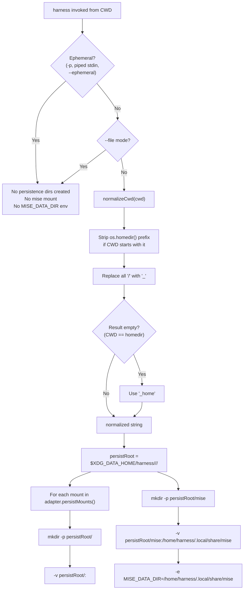
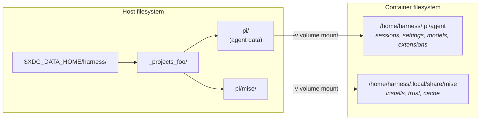
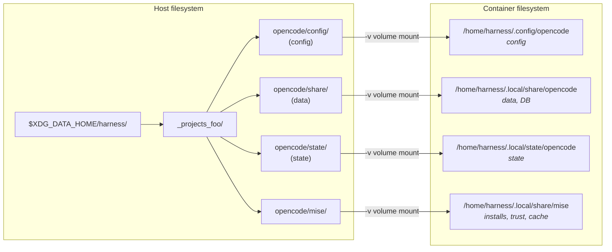
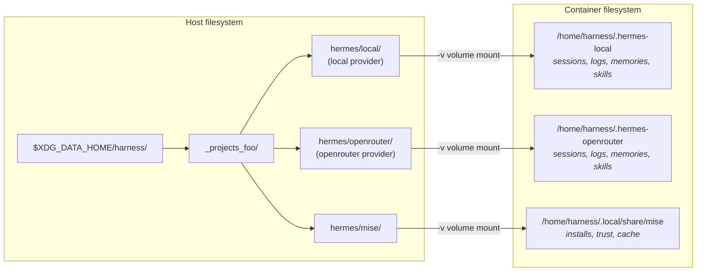

# Agent Persistence: XDG Data Home Migration

**Date:** 2025-05-23
**Status:** Draft

## Goal

Move per-agent persistence from `<cwd>/.harness/<agent>/` to `$XDG_DATA_HOME/harness/<normalized-cwd>/<agent>/`. Add per-agent `mise` data persistence so that tool installs, trust settings, and cached downloads survive container restarts.

## CWD Normalization

Given the absolute CWD:

1. If CWD starts with `os.homedir()`, strip that prefix
2. Replace all remaining `/` with `_`
3. If the result is empty (CWD is exactly the home directory), use `_home`

| CWD | Normalized |
|-----|-----------|
| `/home/user/projects/foo` | `_projects_foo` |
| `/home/user/projects/bar/baz` | `_projects_bar_baz` |
| `/home/user` | `_home` |
| `/tmp/sandbox` | `_tmp_sandbox` |
| `/` | `_` |

## New Host-Side Directory Structure

```text
$XDG_DATA_HOME/harness/                          # root (default: ~/.local/share/harness/)
└── _projects_foo/                               # <normalized-cwd>
    ├── pi/                                      # <agent>
    │   └── (agent data)                         # mounted at /home/harness/.pi/agent
    ├── pi/mise/                                 # mounted at /home/harness/.local/share/mise
    ├── opencode/
    │   ├── config/                              # mounted at /home/harness/.config/opencode
    │   ├── share/                               # mounted at /home/harness/.local/share/opencode
    │   ├── state/                               # mounted at /home/harness/.local/state/opencode
    │   └── mise/                                # mounted at /home/harness/.local/share/mise
    └── hermes/
        ├── local/                               # mounted at /home/harness/.hermes-local
        ├── openrouter/                          # mounted at /home/harness/.hermes-openrouter
        └── mise/                                # mounted at /home/harness/.local/share/mise
```

## Adapter Mount Mapping

Each adapter's `persistMounts()` is unchanged. The `hostSubpath` is now resolved relative to `$XDG_DATA_HOME/harness/<normalized-cwd>/<agent>/` instead of `<cwd>/.harness/<agent>/`.

**Mise** is added by the CLI automatically for all agents (not part of `persistMounts()`).

### Pi Adapter

| Host subpath (under persist root) | Container path | Extra env |
|-----------------------------------|---------------|-----------|
| *(root, empty hostSubpath)* | `/home/harness/.pi/agent` | — |
| `mise/` | `/home/harness/.local/share/mise` | `MISE_DATA_DIR=/home/harness/.local/share/mise` |

### OpenCode Adapter

| Host subpath | Container path | Extra env |
|-------------|---------------|-----------|
| `config/` | `/home/harness/.config/opencode` | — |
| `share/` | `/home/harness/.local/share/opencode` | — |
| `state/` | `/home/harness/.local/state/opencode` | — |
| `mise/` | `/home/harness/.local/share/mise` | `MISE_DATA_DIR=/home/harness/.local/share/mise` |

### Hermes Adapter

| Host subpath | Container path | Extra env |
|-------------|---------------|-----------|
| `local/` | `/home/harness/.hermes-local` | — |
| `openrouter/` | `/home/harness/.hermes-openrouter` | — |
| `mise/` | `/home/harness/.local/share/mise` | `MISE_DATA_DIR=/home/harness/.local/share/mise` |

## Mermaid Diagrams

### Persistence Resolution Flow



### Host ↔ Container Volume Mapping — Pi



### Host ↔ Container Volume Mapping — OpenCode



### Host ↔ Container Volume Mapping — Hermes



## Code Changes

### `src/harness.ts`

**1. New helper: `normalizeCwd()`**

```typescript
function normalizeCwd(cwd: string): string {
  const home = os.homedir();
  let normalized = cwd;
  if (normalized.startsWith(home)) {
    normalized = normalized.slice(home.length);
  }
  normalized = normalized.replace(/\//g, "_");
  if (normalized === "") {
    normalized = "_home";
  }
  return normalized;
}
```

**2. New helper: `xdgDataDir()`**

```typescript
function xdgDataDir(): string {
  return process.env.XDG_DATA_HOME || path.join(os.homedir(), ".local", "share");
}
```

**3. Change `persistRoot` calculation** (in `run()`)

```typescript
// Before:
const persistRoot = path.join(workspace, ".harness", agentName);

// After:
const persistRoot = path.join(
  xdgDataDir(),
  "harness",
  normalizeCwd(workspace),
  agentName,
);
```

**4. Add mise mount** (in `run()`, inside the `!effectiveEphemeral` block, after the adapter persist mount loop)

```typescript
// Per-agent mise persistence
const miseHostPath = path.join(persistRoot, "mise");
fs.mkdirSync(miseHostPath, { recursive: true });
volumeArgs.push("-v", `${miseHostPath}:/home/harness/.local/share/mise`);
adapterDockerArgs.push("-e", "MISE_DATA_DIR=/home/harness/.local/share/mise");
```

Note: `adapterDockerArgs` is currently `const` — it needs to become mutable (or we append the mise env to a separate array). The simplest approach is to collect mise env vars in a separate array and spread them into the final `args`.

**5. Remove all `.harness` references**

- No more `<cwd>/.harness/` creation
- The `normalizeCwd` and `xdgDataDir` functions replace the old path logic

**6. Update `USAGE` string**

- Remove references to `.harness` directory
- Document `XDG_DATA_HOME` override in the environment variables section

### Entrypoints — No Changes

Entrypoints seed defaults into container-side paths (`/home/harness/.pi/agent`, etc.) using `cp -rn` (no-clobber). When a persist volume is mounted, existing files are preserved; missing defaults are seeded. This behavior is unchanged.

### Dockerfiles — No Changes

Container-side paths are unchanged. All changes are host-side path resolution in `harness.ts`.

### Tests (`tests/e2e/cli.test.mjs`)

**Update existing tests:**

| Old assertion | New assertion |
|--------------|---------------|
| `fs.existsSync(path.join(cwd, ".harness", "pi"))` | `fs.existsSync(path.join(xdgDataDir, "harness", normalizeCwd(cwd), "pi"))` |
| `fs.existsSync(path.join(cwd, ".harness", "opencode", "config"))` | `fs.existsSync(path.join(xdgDataDir, "harness", normalizeCwd(cwd), "opencode", "config"))` |
| Docker arg endsWith `:/home/harness/.pi/agent` | Same (container paths unchanged) |
| No `.harness/` in CWD (ephemeral tests) | Also assert no `.harness/` in CWD AND no dir in XDG location |

All persistence tests should set `XDG_DATA_HOME` to a temp directory (same pattern as the skills tests that override `HOME`).

**New tests to add:**

1. **CWD normalization unit tests:**
   - `/home/user/projects/foo` → `_projects_foo`
   - `/home/user` → `_home`
   - `/tmp/sandbox` → `_tmp_sandbox`

2. **Mise mount presence:**
   - Interactive mode creates `<persistRoot>/mise/` and mounts it
   - `-v` mount targets `/home/harness/.local/share/mise`
   - `-e MISE_DATA_DIR=/home/harness/.local/share/mise` is present

3. **Mise is not mounted in ephemeral mode:**
   - `-p` mode: no mise dir, no `MISE_DATA_DIR` env

4. **`XDG_DATA_HOME` override:**
   - Set `XDG_DATA_HOME=/tmp/custom-xdg`, verify persist dirs created there

5. **No `.harness/` in CWD:**
   - Verify the old `.harness/` directory is never created in any mode

6. **Edge case: CWD is home directory:**
   - Normalize to `_home`, verify dirs created at `$XDG_DATA_HOME/harness/_home/<agent>/`

## What Stays the Same

- **Ephemeral behavior:** `-p`, piped stdin, `--ephemeral` → no persistence dirs created anywhere
- **`--file` mode:** still skips persistence entirely
- **Adapter `persistMounts()` interface:** unchanged — adapters still declare `(hostSubpath, containerPath)` pairs
- **Cosign cache:** already at `$XDG_CACHE_HOME/harness/` (unaffected)
- **Skills mounting:** `~/.agents/skills` and `~/.claude/skills` (unaffected)
- **Container-side paths:** all unchanged
- **Security flags:** `--cap-drop=ALL`, `seccomp`, `no-new-privileges` (unchanged)
- **Entrypoints:** no changes
- **Dockerfiles:** no changes
- **CI/CD:** no changes

## Migration: Deprecation Warning

Existing `.harness/` directories in CWDs will become orphaned. No auto-migration, no fallback. When harness detects a `.harness/` directory in the CWD, it emits a one-time warning to stderr:

```text. Persistence data now lives at ~/.local/share/harness/<project>/<agent>/. To migrate session data, copy the contents of .harness/<agent>/ to the new location. Otherwise this directory can be safely deleted.
```

The old directory is not read or written — the warning is purely informational to help users clean up.

## Cleanup

Per-project cleanup is straightforward: `rm -rf $XDG_DATA_HOME/harness/<normalized-cwd>` removes all agents and mise data for that project in one operation.

## Implementation Checklist

- [ ] Add `normalizeCwd()` to `src/harness.ts`
- [ ] Add `xdgDataDir()` to `src/harness.ts`
- [ ] Change `persistRoot` from CWD-based to XDG-based
- [ ] Add mise mount + `MISE_DATA_DIR` env in non-ephemeral runs
- [ ] Remove `.harness` path logic from CWD
- [ ] Update `USAGE` help text (add `XDG_DATA_HOME`, remove `.harness` references)
- [ ] Update all persistence assertions in `tests/e2e/cli.test.mjs`
- [ ] Add new tests (normalization, mise, XDG override, no-.harness-in-cwd)
- [ ] Update `README.md` and `AGENTS.md`
- [ ] Verify `pnpm test:e2e` passes
- [ ] Verify `pnpm test:coverage` meets 80% threshold
