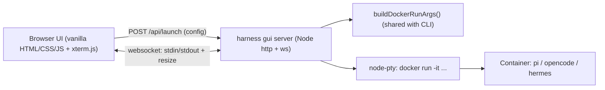
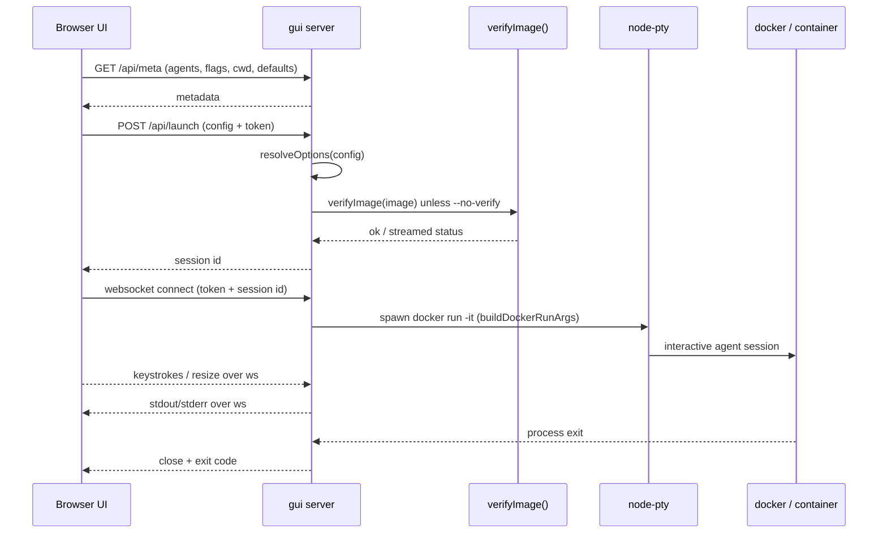

# Web GUI: `harness gui` Subcommand

**Date:** 2026-06-16
**Status:** Proposed

## Goal

Add a `harness gui` subcommand that starts a localhost-only web app, making Harness usable without touching the CLI. The UI provides a visual run builder that mirrors every CLI option (agent, model, env-file, prompt, flags, volumes) plus an embedded `xterm.js` terminal that streams the real, full-fidelity interactive agent session over a websocket-backed PTY. The result is a true drop-in: `npx @capotej/harness gui` from any project opens a browser and runs an agent against that directory.

## Motivation

Today every run is configured and driven through the CLI ([src/harness.ts](../src/harness.ts)). This is fast for power users but creates friction for anyone who wants to:

- Discover and toggle options (agent, model, `--no-skills`, `--ephemeral`, `--local`, `--volumes`, etc.) without memorizing flags.
- Manage an agent run visually while still getting the rich interactive TUI the agents (`pi`, `opencode`, `hermes`) provide.
- Adopt Harness on a new project with zero CLI ceremony — the same "point it at a directory" promise, but through a UI.

A small, localhost-only web app preserves the existing zero-install / npx ethos (no desktop bundle to maintain, works on any OS) while removing the need to manage all prompting via the CLI.

## Scope (v1)

In scope:

- `harness gui` subcommand that launches a local web server and opens the browser.
- Visual run builder mirroring all current CLI options.
- A config/launch panel plus an embedded live terminal (the interactive agent session).
- Working directory defaults to where `harness gui` is invoked (the server's CWD).
- Single active session.

Out of scope (noted for future RFCs):

- Multiple concurrent sessions / tabs.
- Persistence browser (managing state under the XDG data dir).
- Env-file / API-key management UI.
- Project / folder picker (point at arbitrary directories).
- Run history / saved presets.

## Technology

- **Backend:** Node built-in `http` server + [`ws`](https://github.com/websockets/ws) websocket library. Reuses the existing `docker` argument construction so the GUI inherits all security flags, mounts, persistence, skills/context-file handling, and cosign verification.
- **PTY:** [`node-pty`](https://github.com/microsoft/node-pty) to allocate a real terminal for `docker run -it ...`, enabling full interactive-TUI fidelity (raw mode, resize). Native module with prebuilt binaries, so `npx` keeps working on common platforms.
- **Frontend:** Build-free vanilla HTML/CSS/JS (no bundler/framework) with [`@xterm/xterm`](https://github.com/xtermjs/xterm.js) + `@xterm/addon-fit`, vendored into `bin/gui/public/vendor/` at build time.

These add runtime dependencies (`node-pty`, `ws`) to a package that currently depends only on `minimist`. All new deps will be pinned, consistent with the project's supply-chain ethos.

## Architecture



### Request / session flow



## Code Changes

### `src/harness.ts` — refactor for a single source of truth

All docker-arg logic currently lives inline in `run()` (the body spanning roughly lines 505-642). Extract behavior-preserving helpers so the GUI reuses the exact same construction:

- `resolveOptions(input)` — validates agent / `--file` / `--env-file` / `--volumes` (the checks currently at lines ~449-503) and returns a normalized options object.
- `buildDockerRunArgs(opts)` — returns `{ image, args, willVerify }` (the body of `run()`), parameterized by `workspace`, agent, model, prompt, envFilePath, fileArg, flags, and volumes.
- `verifyImage()` stays as-is and is callable from both the CLI and the GUI server.
- CLI `run()` becomes a thin caller of these helpers.

This refactor must be behavior-preserving so the existing e2e suite ([tests/e2e/cli.test.mjs](../tests/e2e/cli.test.mjs)) stays green.

### `src/harness.ts` — subcommand dispatch

After `minimist` parsing (around lines 444-459), detect the positional subcommand and hand off before the normal run/stdin path:

```typescript
if (argv._[0] === "gui") {
  const port = typeof argv.port === "number" ? argv.port : 4399;
  const open = argv.open !== false; // --no-open disables
  startGuiServer({ port, open, workspace });
  return;
}
```

Add `--port <n>` and `--no-open` to `MINIMIST_OPTS`, the unknown-flag allowlist, and the `USAGE` string.

### `src/gui/server.ts` — new file

- Node `http` server bound to `127.0.0.1` only; default port `4399`, overridable with `--port`.
- Generate a per-process session token; embed it in the opened URL and require it on `/api/*` and the websocket handshake (prevents other local processes from driving docker on the user's files).
- Routes:
  - `GET /` and static assets from `bin/gui/public`.
  - `GET /api/meta` — agents, available flags, current CWD, and defaults for the run builder.
  - `POST /api/launch` — accepts the run config, validates via `resolveOptions`, runs `verifyImage` unless `--no-verify`, returns a session id.
- Websocket (via `ws`): on connect, call `buildDockerRunArgs()` and spawn `docker` through `node-pty` with `-it`; pipe pty <-> ws (stdout/stderr down, stdin up), handle `{ type: "resize", cols, rows }`, and clean up on process exit (send exit code, close socket).
- Best-effort browser auto-open (`open` / `xdg-open` / `start`), skippable with `--no-open`.

### `src/gui/public/` — new files (no bundler)

- `index.html`, `styles.css`, `app.js` — modern, clean layout: left = run builder, right = terminal.
- Run builder mirrors every CLI option: agent (`pi` / `opencode` / `hermes`), model, env-file path, prompt (optional; empty = interactive), `--file`, repeatable `--volumes`, and toggles for `--no-skills` / `--no-context-files` / `--ephemeral` / `--local` / `--no-verify`. Displays the equivalent CLI command for transparency.
- Terminal: `@xterm/xterm` + `@xterm/addon-fit` wired to the websocket, with fit + resize forwarding.

### `package.json` — deps and build

- Add runtime deps (pinned): `node-pty`, `ws`.
- Add dev deps (pinned): `@xterm/xterm`, `@xterm/addon-fit`, `@types/ws`. xterm assets are vendored into `bin/` at build time, so they can remain dev-only.
- Extend the `build` script: after `tsc`, copy `src/gui/public` -> `bin/gui/public` and copy xterm `lib`/`css` into `bin/gui/public/vendor/` (alongside the existing seccomp copy).
- `tsconfig.json` already compiles `src/**`, so `src/gui/server.ts` -> `bin/gui/server.js`.
- `files: ["bin/"]` already ships everything under `bin/`.

### Tests (`tests/e2e/cli.test.mjs`) and coverage

- Add focused unit tests for `buildDockerRunArgs` / `resolveOptions` (deterministic and security-relevant) to keep the important logic covered.
- The websocket / PTY server glue in `src/gui/server.ts` is I/O-heavy and hard to cover deterministically; exclude it from the coverage gate (adjust `--test-coverage-include` or add an exclude in the `test:coverage` script) so the 80% threshold enforced in [.github/workflows/e2e.yml](../.github/workflows/e2e.yml) stays green.
- E2e tests remain runnable without Docker (shim-based), per project rule.

### Docs

- `README.md`: add a "GUI" section (`npx @capotej/harness gui`) and document the `gui` subcommand plus `--port` / `--no-open` in the CLI reference.
- `AGENTS.md`: document the new `src/gui/` subsystem, the shared `buildDockerRunArgs` refactor, the new dependencies, and the build step that vendors xterm.

## Security Considerations

- Server binds to `127.0.0.1` only; never `0.0.0.0`.
- Per-session token required for `/api/*` and the websocket, so other local users/processes cannot launch containers against the user's files.
- The GUI does not weaken any container hardening: it reuses `buildDockerRunArgs()`, so `--cap-drop=ALL`, `--cap-add=NET_RAW`, `no-new-privileges`, the seccomp profile, and cosign verification all apply identically to CLI runs.
- New dependencies (`node-pty`, `ws`, xterm) are pinned, consistent with the dependency-cooldown / pinning ethos.

## What Stays the Same

- All existing CLI behavior, flags, and output — the GUI is additive.
- Container-side paths, entrypoints, and Dockerfiles — no changes.
- Security model (capabilities, seccomp, `no-new-privileges`, cosign verification) — unchanged and reused.
- Persistence (`$XDG_DATA_HOME/harness/<project>/<agent>/`), skills, and context-file mounting — unchanged and reused via the shared builder.
- E2e tests remain Docker-free (shim-based).

## Open Questions

- Should `harness gui` also expose a `--host` flag for users who explicitly want LAN access (off by default, with a clear warning)? Default v1 answer: no, localhost only.
- Whether to surface a minimal project/folder picker in v1 or keep strictly to CWD. Default v1 answer: CWD only.

## Implementation Checklist

- [ ] Extract `resolveOptions()` and `buildDockerRunArgs()` from `run()` in `src/harness.ts` (behavior-preserving)
- [ ] Add `gui` subcommand dispatch with `--port` / `--no-open` and update `USAGE`
- [ ] Implement `src/gui/server.ts` (localhost http + token, `/api/meta`, `/api/launch`, ws <-> node-pty session with resize)
- [ ] Build `src/gui/public/` (run builder mirroring all CLI options + xterm.js terminal)
- [ ] Add `node-pty` / `ws` deps (+ xterm and `@types/ws` dev deps), pinned
- [ ] Extend the `build` script to copy `public` and vendor xterm into `bin/gui`
- [ ] Add unit tests for `buildDockerRunArgs` / `resolveOptions`; exclude `src/gui/server.ts` from the coverage gate
- [ ] Update `README.md` and `AGENTS.md`
- [ ] Verify `pnpm test:e2e` passes
- [ ] Verify `pnpm test:coverage` meets the 80% threshold
- [ ] Verify `pnpm lint` passes (biome, markdownlint, etc.)
