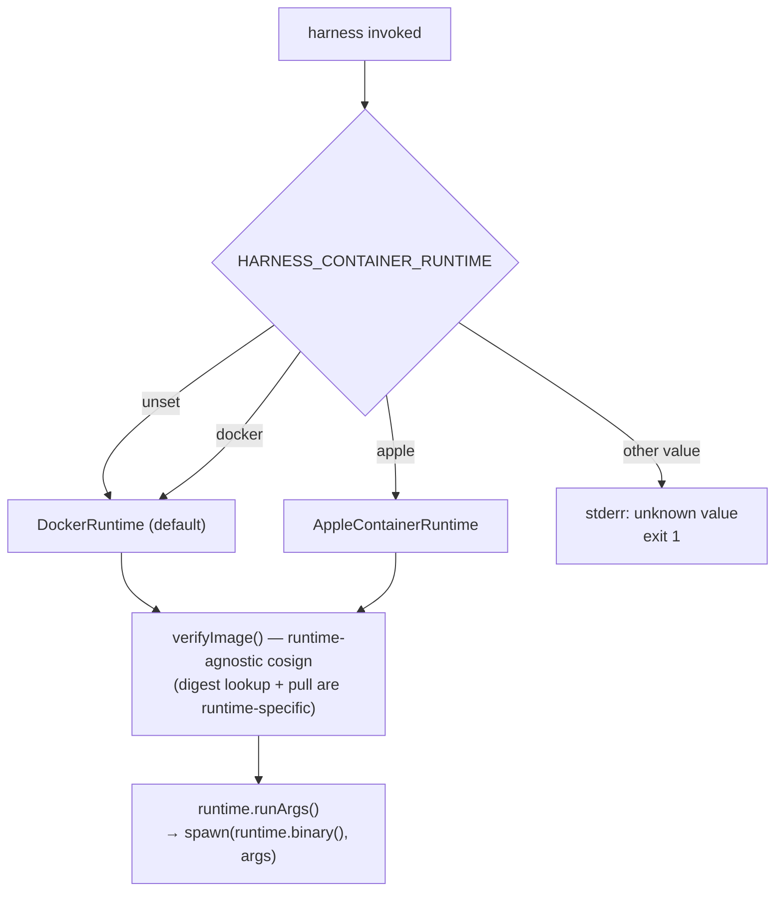
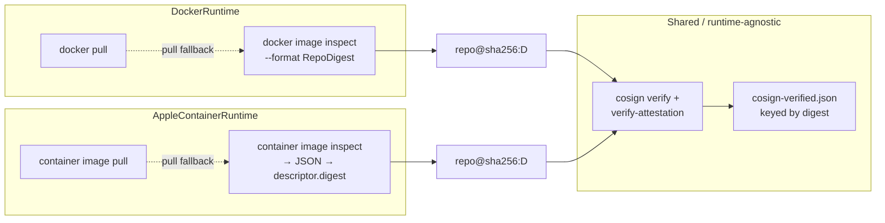

# Container Runtime Selection: Apple `container` Support

**Date:** 2026-06-20
**Status:** Proposed

## Goal

Add a `HARNESS_CONTAINER_RUNTIME` environment variable that selects the
container runtime harness uses to pull and run images. The first non-default
target is [Apple's `container`](https://github.com/apple/container) CLI
(v1.0.0), which runs OCI images as lightweight Linux virtual machines on macOS
26 / Apple Silicon — an alternative to Docker Desktop on the Mac.

- `HARNESS_CONTAINER_RUNTIME=apple`  → use `container` (apple/container)
- `HARNESS_CONTAINER_RUNTIME=docker` → use `docker` (explicit)
- unset                             → use `docker` (current behavior, unchanged)
- any other value                    → hard error with a helpful message

The value is **named, not boolean**. This supersedes the original
`HARNESS_CONTAINER_RUNTIME=1` idea: a named enum is self-documenting in
`env`/`.envrc` files and leaves the design open to future runtimes (e.g.
`podman`) without introducing a second switch.

## Motivation

- harness currently hardcodes `"docker"` in three places (`image inspect`,
  `pull`, and `spawn("docker", …)` for `run`). macOS users who run Apple's
  native `container` instead of Docker Desktop cannot use harness at all today.
- apple/container consumes standard OCI images. harness already publishes
  multi-arch (amd64 + arm64) images to `ghcr.io`, signed with cosign and
  carrying SLSA provenance — so the existing verification story carries over
  with only a digest-lookup change.
- A clean runtime seam keeps the rest of the system (adapters, persistence,
  skills, env-file handling, cosign) untouched and makes future runtimes cheap
  to add.

## Verified CLI Surface (apple/container `1.0.0`)

Source of truth: the `1.0.0` tag of `apple/container`
(`Sources/Services/ContainerAPIService/Client/Flags.swift`,
`Sources/ContainerCommands/Container/ContainerRun.swift`,
`…/Image/ImageInspect.swift`, `…/Client/Parser.swift`).

`container run` supports the options harness needs today:

- Process: `-i/--interactive`, `-t/--tty`, `-w/--workdir`, `-e/--env KEY=VAL`,
  `--env-file <file>`, `--user`, `--uid`, `--gid`, `--ulimit`, `--entrypoint`.
- Management: `-v/--volume host:container[:opts]`, `--mount`, `--rm/--remove`,
  `--cap-add`, `--cap-drop`, `--name`, `-d/--detach`, `--network`,
  `--platform`, `--arch`, `--os`, `--init`.
- Image: `container image pull <ref>` and `container image inspect <ref>`
  (always emits a JSON array; no `--format` flag). `run` auto-pulls the image
  and auto-selects the host architecture (`arm64` on Apple Silicon).

### Runtime Isolation: why seccomp / no-new-privileges are dropped (not a regression)

apple/container has **no** `--security-opt` at all (`Flags.Management` contains
no such option), so under the apple runtime harness does not emit:

- `--security-opt no-new-privileges:true`
- `--security-opt seccomp=<seccomp-profiles/block-af-alg.json>`

This is **not** a meaningful security regression, because of how
`apple/container` isolates workloads:

- **Each container is a microVM** with its own ephemeral guest Linux kernel,
  run under Apple's Virtualization framework (a Type-2 hypervisor on Apple
  Silicon). The agent process runs under that *guest* kernel — it never shares
  the host kernel.
- **`block-af-alg.json` is host-kernel defense-in-depth.** Its
  `defaultAction` is `ALLOW`; it blocks exactly one call —
  `socket(AF_ALG=38, …)`, the Linux kernel crypto API socket family. That only
  matters when a container process shares the host kernel (the docker model),
  which is precisely what the microVM model prevents. Under `=apple` the
  AF_ALG vector can only hit the throwaway guest kernel, never the host; the
  host is protected by the VM boundary itself (hardware-assisted isolation,
  strictly stronger than a syscall filter).
- **`no-new-privileges` is orthogonal** to the isolation model — it is a
  process attribute (`PR_SET_NO_NEW_PRIVS`) that blocks in-context privilege
  escalation via setuid/file caps. Its absence is a minor in-guest
  defense-in-depth loss only, and the harness image is signed + pinned and
  runs as the non-root `harness` user.

Capability restrictions **are** supported (`--cap-add`/`--cap-drop`, accepting
`CAP_NET_RAW`, bare `NET_RAW`, or `ALL`), so `--cap-drop=ALL --cap-add=NET_RAW`
stays on both runtimes. No per-run warning is emitted; the omission is
documented here and in `README.md`.

### What is compatible (and needs no special handling)

- harness already uses the **long** form `--env-file <path>` for env files and
  `-e KEY=VAL` for individual variables. In `container`, `-e` *is* `--env`
  (not `--env-file`), but because harness never passes a file via bare `-e`,
  the existing invocation maps 1:1. **No change required.**
- `--volume` parsing in apple/container accepts up to three colon-separated
  fields and splits the third on `,` for options — identical to docker's
  `host:container[:opts]` shape. `ro`/`readonly` is honored. (host paths must
  already exist; harness `mkdir -p`s its own mounts, and the existing
  user-`-v` validation already rejects missing sources.)
- `-i`/`-t`/`-v`/`--rm`/`-w`/`--entrypoint`/positional `image cmd…` are
  behaviorally identical.

### Differences that require code changes

| Concern | docker | apple/container | Action |
|---|---|---|---|
| Binary name | `docker` | `container` | parameterize |
| Interactive tty | `-it` (clustered) | `-i -t` (emit separately) | emit separate tokens |
| Capability form | `--cap-drop=ALL` | `--cap-drop ALL` | normalize to space-separated |
| Seccomp / no-new-privileges | `--security-opt …` | unsupported | drop (see *Runtime Isolation*) |
| Local digest lookup | `docker image inspect --format …` (Go template) | `container image inspect` → JSON | new JSON parser |
| Digest value | `.RepoDigests[0]` → `repo@sha256:<d>` | `data[0].configuration.descriptor.digest` → `sha256:<d>` (index/manifest-list digest) | rebuild `repo@<d>` for cosign |
| Explicit pull | `docker pull` | `container image pull` (nested under `image`) | runtime-specific command |
| Runtime daemon | `dockerd` (Docker Desktop) | `container` system service (`container system start`) | detect + helpful error |

The descriptor digest apple/container reports is the **image index / manifest
list** digest, which is exactly what cosign signs for a multi-arch image and
what docker exposes as the `RepoDigest`. The two are equivalent for cosign
verification purposes — see the cache note below.

## Architecture

Introduce a small runtime abstraction in `src/harness.ts`. The rest of the
system (adapters, `persistMounts`, skills/context-file mounts, ephemeral logic,
cloud-mode env, image-tag selection, entrypoints, Dockerfiles, CI) is
unchanged.

```typescript
interface ContainerRuntime {
  /** Binary name on PATH. */
  binary(): string;
  /** Token list for the image pull command (without the image, which is appended). */
  pullArgs(image: string): string[];
  /** Resolve the local registry digest for an image, or null if absent. */
  localDigest(image: string): string | null;
  /** Build the full `run` argv (everything after the binary name). */
  runArgs(input: RunInput): string[];
  /** Whether seccomp / no-new-privileges can be applied. */
  supportsSecurityOpts(): boolean;
}

interface RunInput {
  ttyFlags: string[];          // ["-it"] or ["-i"]
  securityFlags: string[];     // cap-drop/cap-add + (optionally) security-opt
  envFileArgs: string[];
  envArgs: string[];           // cloud-mode, adapter, mise envs
  volumeArgs: string[];
  userVolumeArgs: string[];
  workdir: string;
  image: string;
  containerCmd: string[];
}
```

Two implementations:

```typescript
class DockerRuntime implements ContainerRuntime { /* current behavior, verbatim */ }
class AppleContainerRuntime implements ContainerRuntime {
  supportsSecurityOpts() { return false; }
  // runArgs() emits "-i" "-t" instead of "-it", space-separated cap flags,
  // and OMITS the two --security-opt tokens.
  // localDigest() runs `container image inspect <image>`, parses JSON, and
  // returns data[0].configuration.descriptor.digest (or null on failure).
  // pullArgs() returns ["image","pull"].
}
```

Selection (case-insensitive value):

```typescript
function selectRuntime(): ContainerRuntime {
  const raw = (process.env.HARNESS_CONTAINER_RUNTIME ?? "docker").toLowerCase();
  switch (raw) {
    case "docker": return new DockerRuntime();
    case "apple":  return new AppleContainerRuntime();
    default:
      console.error(
        `harness: unknown HARNESS_CONTAINER_RUNTIME="${raw}". ` +
        `Valid values: apple, docker (or unset for docker).`,
      );
      process.exit(1);
  }
}
```

### Runtime Selection Flow



### Verification Path Under Each Runtime



The cosign cache is **keyed by digest, not by runtime**, so a digest verified
under docker is a cache hit under apple/container (and vice versa). Switching
runtimes does not force a re-verify of the same image bytes.

## Code Changes

### `src/harness.ts`

1. **Add the `ContainerRuntime` interface and the two implementations**
   (`DockerRuntime`, `AppleContainerRuntime`) as described above. `DockerRuntime`
   reproduces today's exact arg construction so the default path is byte-for-byte
   unchanged.
2. **Refactor the three docker call sites** to go through the runtime:
   - `inspectLocalImage()` → `runtime.localDigest(image)` (was
     `execFileSync("docker", ["image","inspect","--format", …])`).
   - `verifyImage()` pull fallback → `execFileSync(runtime.binary(),
     runtime.pullArgs(image), …)`.
   - `run()` final spawn → `spawn(runtime.binary(), runtime.runArgs(input), …)`.
3. **Add `selectRuntime()`** and call it once near the top of `run()` (and reuse
   the instance for verify). Unknown value → stderr + `process.exit(1)`.
4. **Capability normalization for the apple path**: emit
   `"--cap-drop","ALL","--cap-add","NET_RAW"` (space-separated) rather than the
   `=`-joined form, and emit `"--interactive"`/`"--tty"` tokens separately
   instead of the clustered `"-it"`. (docker keeps its current clustered/`=`
   form via `DockerRuntime`, preserving exact argv for existing tests.)
5. **Apple digest parser** (small, dependency-free):

   ```typescript
   function appleLocalDigest(image: string): string | null {
     let out: string;
     try {
       out = execFileSync("container", ["image", "inspect", image], {
         stdio: ["ignore", "pipe", "ignore"], timeout: 5000,
       }).toString();
     } catch { return null; }
     try {
       const parsed = JSON.parse(out);
       const digest = Array.isArray(parsed) ? parsed[0]?.configuration?.descriptor?.digest : null;
       return typeof digest === "string" && /^sha256:[0-9a-f]{64}$/.test(digest)
         ? `${image.split(":")[0]}@${digest}`  // repo@sha256:<digest>
         : null;
     } catch { return null; }
   }
   ```

   (Reuses the same `/@sha256:<64hex>$/` shape `inspectLocalImage` validates
   against, so `verifyImage`'s cache and cosign logic are unchanged.)

   No per-run seccomp/no-new-privileges warning is emitted — see
   *Runtime Isolation* above for why dropping those flags is not a security
   regression under the microVM model.

6. **Runtime prerequisite check (apple only)**: before spawning, probe
   `container --version`; if missing, print:

   ```text
   harness: HARNESS_CONTAINER_RUNTIME=apple requires the `container` CLI (Apple container, v1.0.0+). Install from https://github.com/apple/container/releases and run `container system start`, or unset HARNESS_CONTAINER_RUNTIME to use docker.
   ```

7. **`USAGE` help text**: document `HARNESS_CONTAINER_RUNTIME` in the
   environment-variables section.

### Dockerfiles / Entrypoints / CI — No Changes

Container-side behavior is identical; this is purely a host-side runtime choice.
Images, tags, cosign signing, and provenance attestation are unaffected. CI
keeps building/testing with docker.

## Tests (`tests/e2e/cli.test.mjs`)

The e2e suite shadows the runtime binary with a shim that prints
`RUNTIME_INVOKED <args>`. To stay backward-compatible with the existing
`DOCKER_INVOKED` fixtures while covering both runtimes, the shim is
parameterized by the binary name it's installed as (`docker` or `container`),
and the helper is renamed/generalized:

- `dockerArgs(stdout)` → `runtimeArgs(stdout)` returning the token list after
  the `*_INVOKED` marker.

**New tests:**

1. **Runtime selection from env var**
   - unset → `docker` invoked.
   - `=docker` → `docker` invoked.
   - `=apple` → `container` invoked.
   - `=APPLE` / `=Docker` (case-insensitive) → correct binary.
   - `=podman` (unknown) → non-zero exit and the "unknown … Valid values"
     message on stderr; no runtime spawned.

2. **Apple runtime arg shape** (against a `container` shim):
   - First two tokens are `run` then `--rm`.
   - Interactive: tokens contain `-i` and `-t` **separately** (no `-it`).
   - Capabilities emitted as `--cap-drop` `ALL` `--cap-add` `NET_RAW`
     (space-separated, not `=`-joined).
   - **No** `--security-opt` token anywhere in the argv.
   - `--env-file`, `-e KEY=VAL`, `-v`, `-w /workspace`, image, and trailing
     command present and identical to the docker path.

3. **No per-run security-regression noise**: assert the apple path emits **no**
   seccomp/no-new-privileges warning to stderr (the omission is intentional and
   documented, not a regression). Also assert no `--security-opt` token appears
   in the argv (already implied by test 2, restated for clarity).

4. **Missing runtime binary (apple)**: with `container` absent from PATH,
   harness exits non-zero with the install hint and does not attempt a spawn.

5. **Cosign cache is runtime-agnostic**: seed `cosign-verified.json` with a
   `repo@sha256:<d>` entry; run under both `=apple` and `=docker` with
   `--no-verify`-equivalent fixtures and assert neither path re-verifies. (The
   digest is the same logical bytes.)

**Existing tests** continue to pass unchanged because the default
(`DockerRuntime`) reproduces today's argv byte-for-byte.

## What Stays the Same

- Adapters (`PiAdapter`, `OpenCodeAdapter`, `HermesAdapter`), `persistMounts`,
  and the per-agent/XDG/mise persistence layout.
- Skills and global context-file mounts.
- Ephemeral vs persistent behavior, `--file` mode, cloud/local mode.
- Image tag selection (`<version>` vs `<agent>-<version>`).
- cosign identity/issuer checks and the `cosign-verified.json` cache (digest-keyed,
  shared across runtimes).
- Entrypoints, Dockerfiles, all CI workflows.
- The default user experience: with `HARNESS_CONTAINER_RUNTIME` unset, harness
  behaves exactly as it does today.

## Migration & Rollout

- **Opt-in, zero default change.** No migration step is required; existing users
  see no difference.
- When implemented, document the variable in `README.md` (environment variables)
  and `AGENTS.md` (Key subsystems → runtime selection).
- Document the prerequisites for the apple path: macOS 26, Apple Silicon, the
  `container` CLI installed, and `container system start` run.
- In `README.md`, note why seccomp/no-new-privileges are not applied under
  `=apple` (microVM isolation subsumes the host-kernel role of the AF_ALG
  seccomp profile), so users don't read the omission as a security regression.

## Resolved Decisions

- **Named values (`apple`|`docker`), not boolean.** Self-documenting in env
  files and extensible to future runtimes without a second variable. Rejected
  the original `=1` boolean form for these reasons; rejected auto-detection of
  the value (e.g. accepting `1`/`true`) to keep parsing strict and errors loud.
- **Explicit env var only.** harness never probes for `container` on PATH to
  pick a runtime implicitly; the user must opt in. Predictable, no surprise
  switches for users who have both runtimes installed.
- **Drop seccomp / no-new-privileges under apple with no warning.** Not a
  security regression: each apple/container workload is a microVM with its own
  guest kernel, so the `block-af-alg.json` profile's host-kernel protection is
  subsumed by the VM boundary itself; `no-new-privileges` is a minor in-guest
  defense-in-depth loss only. Keep capability restrictions (supported). Chosen
  over emitting a one-time warning (would overstate a regression that isn't
  there and add noise on every run) and over blocking the run behind an opt-out
  flag (too conservative for an opt-in runtime). Documented in the RFC and
  `README.md` instead.

## Risks & Open Questions

- **apple/container stability.** v1.0.0 guarantees stability only within patch
  versions; minor versions may break. Pin the documented minimum to `1.0.0` and
  note that the digest JSON path (`configuration.descriptor.digest`) and the
  `image`/`pull` nesting are the load-bearing assumptions.
- **SELinux volume options** (`:Z`/`:ro`-adjacent flags like `:Z`) are
  meaningless under macOS virtiofs and may be passed through or rejected. We
  will document that only `ro`/`readonly` is honored under the apple path.
- **`container` system service must be running.** Mitigated by the
  `container --version` prerequisite probe + install hint.
- **Windows / Linux hosts.** `=apple` on non-darwin hosts will fail at the
  prerequisite probe with the same hint. Acceptable for an opt-in feature.
- **Clustered `-it`.** Swift ArgumentParser *may* accept `-it`, but we emit
  `-i`/`-t` separately to avoid relying on clustering behavior.

## Implementation Checklist

- [ ] Add `ContainerRuntime` interface + `DockerRuntime` (verbatim current
      argv) + `AppleContainerRuntime` to `src/harness.ts`.
- [ ] Add `selectRuntime()` with case-insensitive parsing and unknown-value
      hard error.
- [ ] Route `inspectLocalImage`, the `verifyImage` pull fallback, and the final
      `spawn` through the selected runtime.
- [ ] Implement `appleLocalDigest()` JSON parser; rebuild `repo@<digest>`.
- [ ] Omit seccomp/no-new-privileges on the apple path (no warning); document
      the microVM rationale in `README.md`.
- [ ] Add the `container --version` prerequisite probe + install hint (apple).
- [ ] Generalize the e2e shim (`docker`/`container`, `RUNTIME_INVOKED`) without
      breaking existing `DOCKER_INVOKED`-based assertions.
- [ ] Add tests: selection (4 cases + unknown), apple argv shape, no per-run
      warning noise, missing-binary, shared cosign cache.
- [ ] Update `USAGE` help text with `HARNESS_CONTAINER_RUNTIME`.
- [ ] Update `README.md` (env vars) and `AGENTS.md` (Key subsystems) once
      implemented.
- [ ] Verify `pnpm test:e2e` and `pnpm test:coverage` (≥80%) pass.
